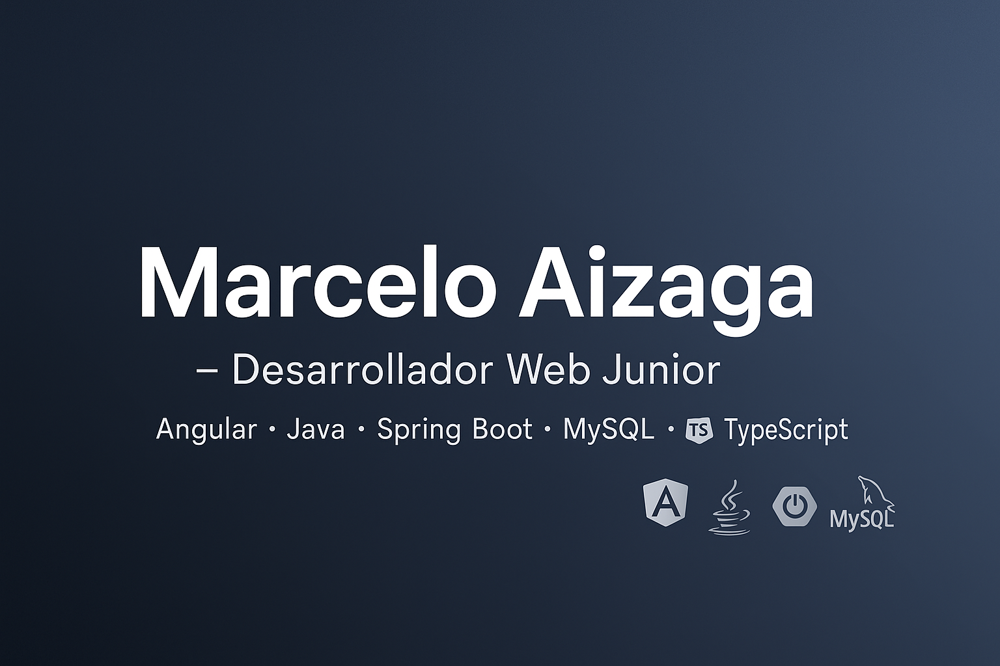

<!-- Banner -->

<h1 align="center">👋 ¡Hola! Soy Marcelo Aizaga</h1>
<h3 align="center">Desarrollador Web Junior | Valencia, España</h3>

  
  
  

---

## 🧑‍💻 Sobre mí
Soy **Desarrollador de Aplicaciones Web** graduado en **DAW**, con experiencia en **Angular, Java, Spring Boot, MySQL** y otras tecnologías.  

Me apasiona crear aplicaciones funcionales con **código limpio** y seguir aprendiendo nuevas herramientas para mejorar mis habilidades.  
Actualmente continúo formándome y desarrollando proyectos personales que puedes ver aquí en mi GitHub.

---

## 💼 Experiencia
- **All Cloud Consulting** – Desarrollador web (prácticas)  
  Desarrollo con **Java + Spring Boot**, consultas SQL, pruebas unitarias, colaboración en equipo con Git.

- **RTVE** – Ayudante de emisión / Continuidad  
  Control de emisión, gestión de escaletas, resolución de incidencias en directo.

---

## 🚀 Tecnologías

**Frontend**  

**Backend**  

**Bases de datos**  

**Herramientas**  

---

## 📂 Proyectos Destacados
| Proyecto | Descripción | Tecnologías |
|----------|-------------|-------------|
| [📇 List Contacts App](https://github.com/celoplay/list-contacts-app) | CRUD de contactos con Angular y TypeScript. | Angular · TypeScript |
| [🍹 Cocktail App](https://github.com/celoplay/cocktail-app) | Búsqueda de cócteles mediante API pública. | Angular · TypeScript |
| [✅ Task List App](https://github.com/celoplay/task-list-app) | Gestión de tareas con filtros y estado. | Angular · TypeScript |
| [📂 TFG – Asignaciones FCT](https://github.com/celoplay/TFG) | Aplicación web para gestión de asignaciones FCT (Spring Boot + Thymeleaf). | Java · Spring Boot · MySQL |

---

## 🌍 Conecta conmigo
- 📧 **Correo:** [celoaizaga@gmail.com](mailto:celoaizaga@gmail.com)  
- 💼 **LinkedIn:** [linkedin.com/in/marcelo-aizaga](https://www.linkedin.com/in/marcelo-aizaga)  
- 🖥️ **GitHub:** [github.com/celoplay](https://github.com/celoplay)  

---
## 📜 Licencia
Mis proyectos están bajo licencia **MIT** salvo que se indique lo contrario.  
Consulta cada repositorio para más detalles.

---

⭐ *Gracias por visitar mi perfil. Estoy abierto a oportunidades como **Desarrollador Web Junior** para aportar valor y seguir creciendo profesionalmente.*
